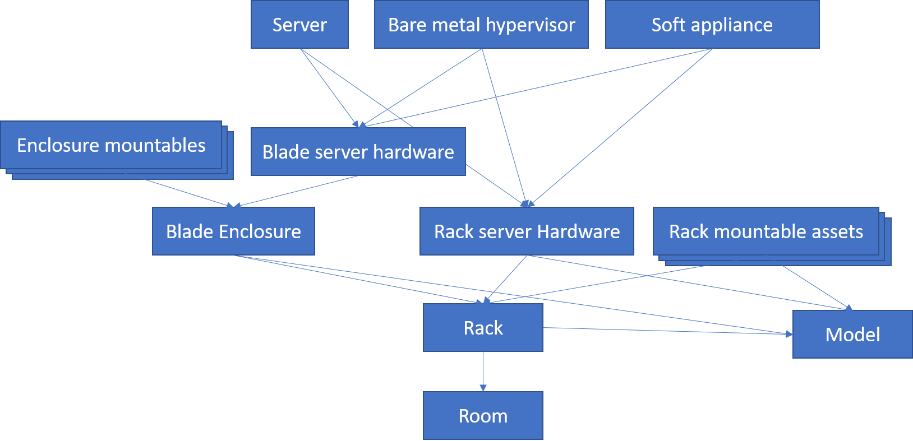

# Data model of the Data Center Manager

Even though the CMDB comes with no data model at all, the DCMan needs a data model to work. The data model is fix, but the names of configuration items, attributes or connection types are configurable. You find the settings.json with all the names and color codes in the assets directory.

## Data model overview

The base types are rooms and models. Rooms have a building name attribute and can hold racks. Models are used for every physical asset type. Additional to the model and manufacturer name and the name of the target asset type, depending on the asset type it holds information about the size of the model, e. g. height units for a rack.

Racks can hold rack mountable assets, which are rack server hardware, blade enclosures, network switches and many more. You can easily [add more types in the program code](Adding-asset-types-to-DCMan).

Blade enclosures have front side and back side slots. Front side slots hold blade server hardware or storage blades, back side slots hold network switches (interconnects) or blade appliances like management modules.

Blade and rack server hardware can have provisionable systems like servers, bare metal hypervisors or software appliances (like a firewall or a NAS system).

## Item types
### Basic types
The basic types are **Rooms** and **Models**.

### Assets
The only non mountable asset type is the **rack**. Every other asset type is being mounted directly into a rack or into a container that is mounted into a rack.

#### Rack mountables
* **Rack server hardware** can hold a provisionable system.
* **Blade enclosures** are containers for enclosure mountables.
* **Backup systems** represent a class of hardware storage for backing up data, like tape drives or virtual tape libraries.
* **Hardware appliances** are complete systems that offer a service. There are lots of examples, like network appliances for DHCP and DNS, firewall systems or enterprise search providers.
* A **Network switch** connects different network devices or acts as routing device
* **Power distribution units** (PDU) connect to high voltage power lines and split it up to provide electricity for devices inside a rack.
* **Storage area network (SAN) switches** are the fibre channel (FC) equivalent for network switches
* **Storage systems** represent big devices offering a huge amount of hard drive space to a SAN or as a NAS.

#### Enclosure mountables
* **Blade server hardware** can hold a provisionable system and is mounted from the front end of a blade enclosure.
* **Store blades** provide lots of hard drives for blade server hardware in the same enclosure. They are mounted from the front side of a blade enclosure
* **Blade appliances** are special managing devices that manage a blade enclosure. They are mounted from the back side of a blade enclosure.
* **Blade interconnects** are network switches that connect blade enclosures to network or SAN switches or tie two enclosures together. They are mounted from the back side of a blade enclosure.

### Provisionable systems
Provisionable systems are being installed into server hardware.
* **Servers** are installed versions of an operating system, like Linux oder Windows Server.
* **Bare metal hypervisors** are installable hypervisors that don't need an operations system, e. g. VMware ESX. Bare metal hyperscalers are not yet implemented, but can be seen as a part of this item class.
* **Software appliances** are black box systems providing a specific service and are installed into a standard server hardware. Examples are firewall or NAS systems.

## Attributes
### Hardware attributes
Hardware attributes are added to all kind of hardware assets. Since most attributes have been moved to the model item type, the only resisual hardware attribute is the **serial number**.

### Model attributes
Model attributes are properties of models. Inside DCMan they differ for different groups of asset:
* **Target type name** describes the item type name that the model is being used for. This attribute must be set to have a valid model, and it determines the other attributes, except manufacturer.
* **Manufacturer** depicts the manufacturer of all the models. Since the name of the model must be unique also across different target types and manufacturers, this may lead to a more complex model description.
* **Height** and **Width** are attributes for blade enclosures and enclosure front end mountables only. In enclosures they hold the number of enclosure (front end) bays in vertical and horizontal direction. In enclosure mountable types the represent the number of bays that are used while mounting.
* **Backside slots** are the number of additional slots on the back side of blade enclosures, where things like management blades or network switches might be added.
* **Height units** are for racks and rack mountable item types. In racks this holds the number of total height units, from bottom as number 1 to top as maximum.

### Network attributes
They are not used inside the DCMan application and exist for possible extensions like connectors only. Maybe they will be moved there later.

They are added to every asset type and to all provisionable systems.
* **Host name** represents the DNS name of the item.
* **IP address** hold one ore more IP addresses, separated by comma of necessary.

### Room attributes
The only room attribute is the **building name**, and it is added to rooms only.

### Status attributes
The only attribute in here is the **status**, which shows the lifecycle position of an arbitrary asset.

## First run
When running the DCMan for the first time, you must use credentials with the admin role in the CMDB backend. At every startup, DCMan compares the data model present in the CMDB with its own data model, and if necessary, it creates all the meta data it needs. For subsequent starts credentials with editor role suffice.