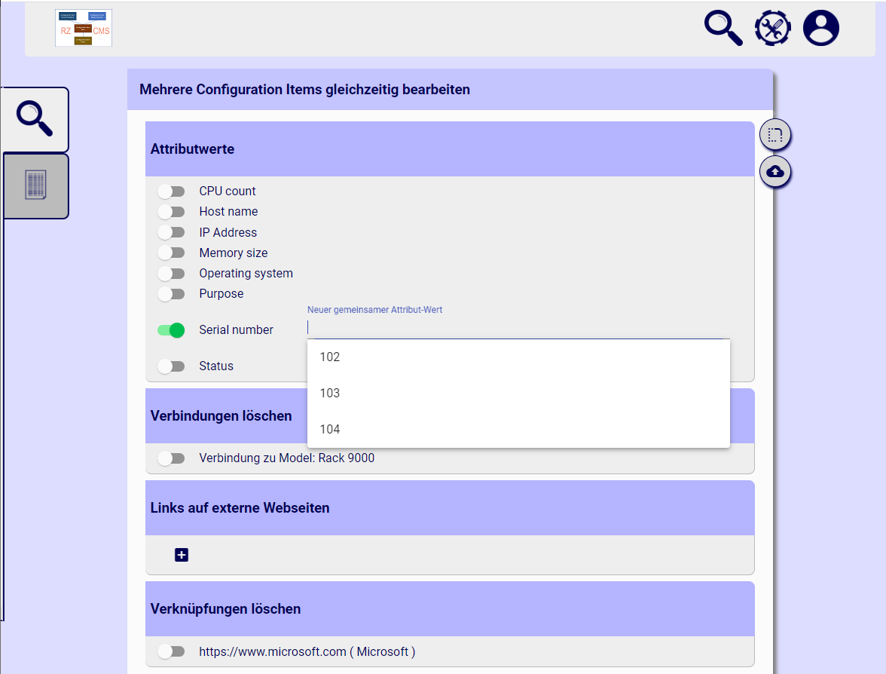
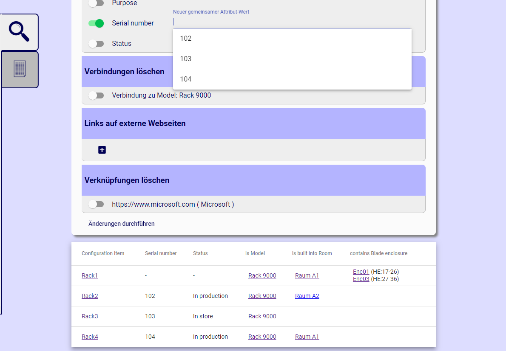

There are many scenarios where to change multiple items at the same time. One solution is to export the result list into a file, edit it and re-import the changes. Another solution is a feature of this application.

You can edit multiple items from the [result list](How-to-use-CMDB-=-Search-results). By starting to edit them, you automatically take responsibility for the items, if you don't have it yet. Since changes are only allowed to responsible users, this must be set prior to editing. Then you can change attribute values, connections or hyperlinks.

Below the editing area you can find a table with all the selected items and their properties.

After submitting the changes, you will be informed about every operation result.