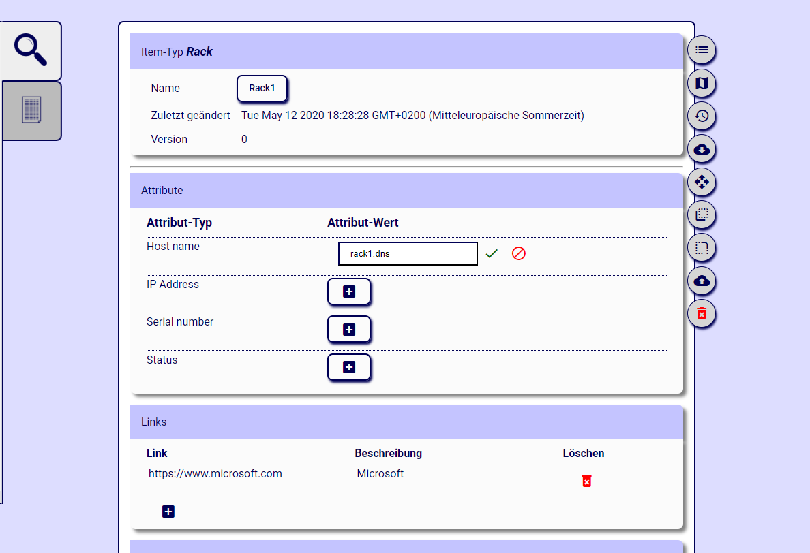

Editing a simple item allows you to edit the name, all attributes, the hyperlinks and the connections to lower items - if you are responsible. If not, a message with a button is shown that lets you take responsibility for that item. You are added to the list of responsible persons. You can remove yourself from that list again, and then no longer have the right to edit the item.

