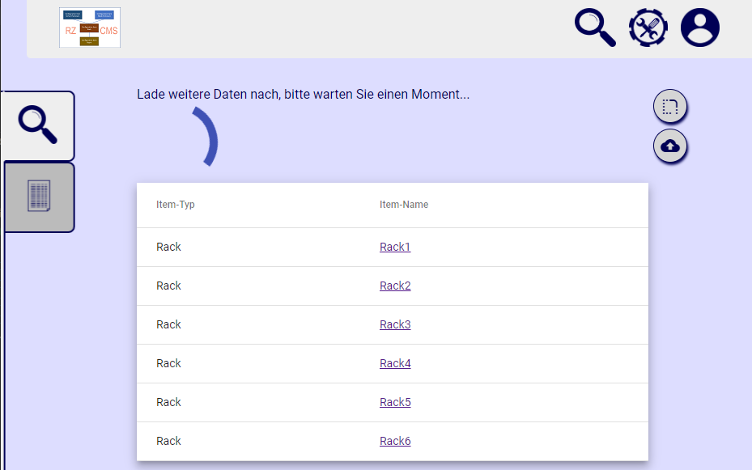
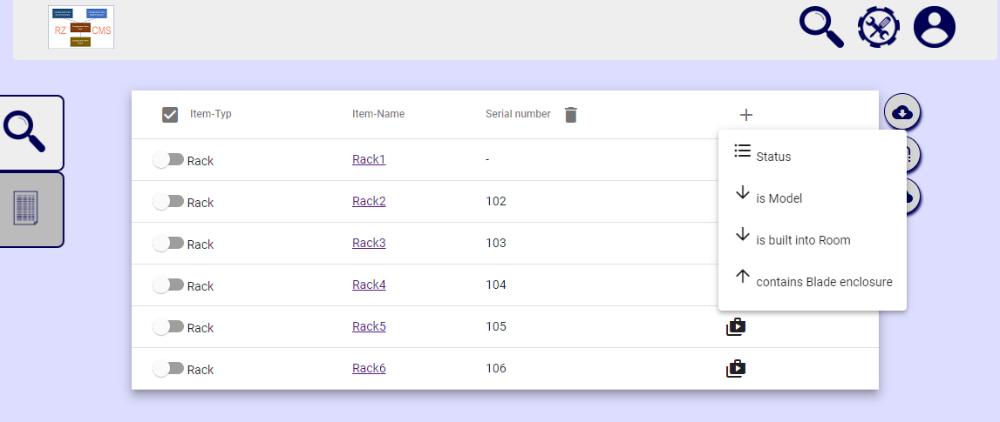
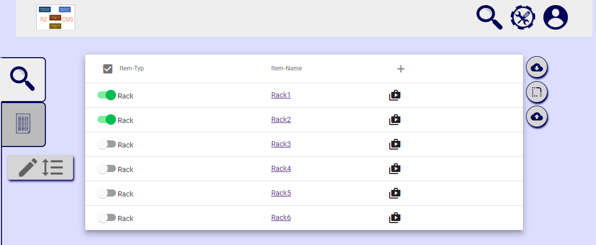

To enhance performance, a result list with only the item names is displayed at first, while in the background all the attributes, connections, links and responsibilities for the items are loaded. You may click on an item name to load that item directly, or wait until the whole list is being displayed.

The whole list allows you to display attributes or connections as extra columns. You can export a list as XLSX of CSV file. The exported list can be changed and re-imported later on.

If you select at least two items, a multi-edit button is being displayed on the left. With that button, you can [edit multible items'](How-to-use-CMDB-=-Editing-multiple-items) attributes, links or connections at the same time.

