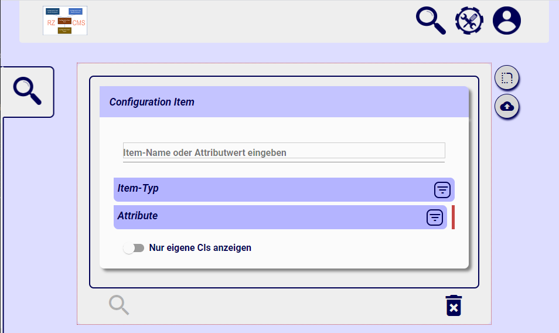
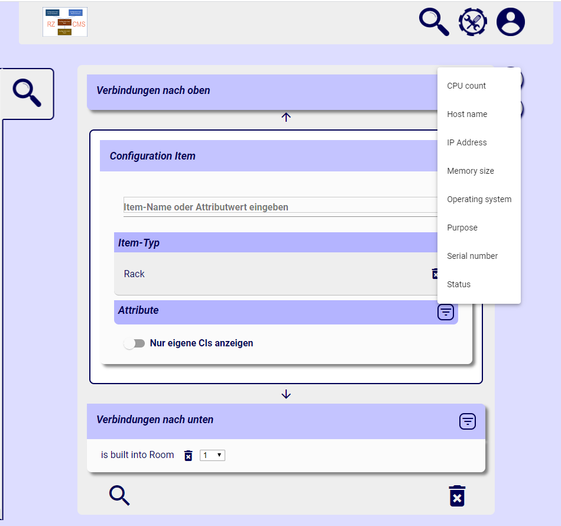

When starting the application, a search form is displayed. Since there may be thousands of configuration items in the database, it makes no sense displaying every item. So you have to choose at least one search criteria to be able to search.

If you set the item type, all allowed connections to item types above and below the current item tye can be chosen. Also the attribute types are reduced to those that are allowed for the current item type.

