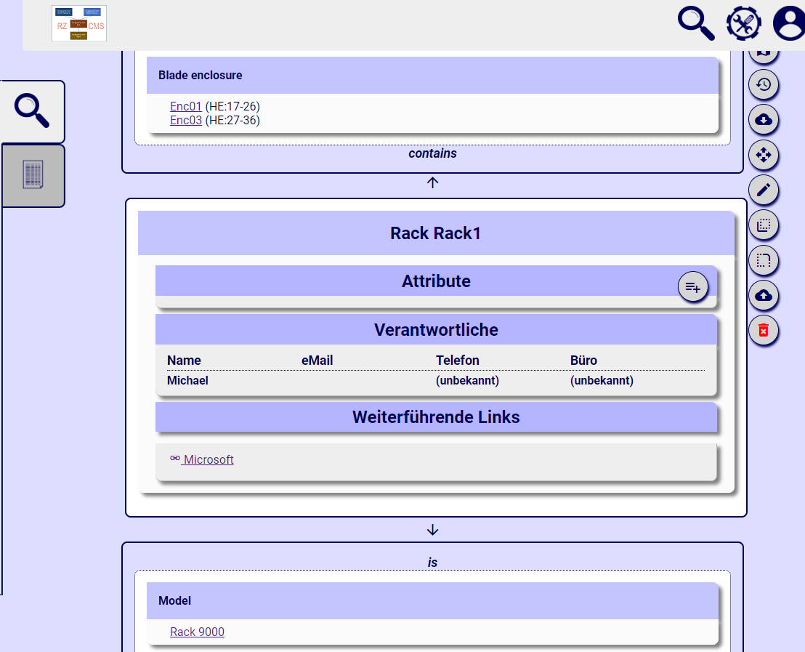

Every person can view all items, but to be allowed to edit, you must be in the role of at least an editor.

An item is shown with all its attributes, connections above and below, hyperlinks and responsiblities.

The button list on the right (or on top on narrow screens) allows you to start other actions with the item.