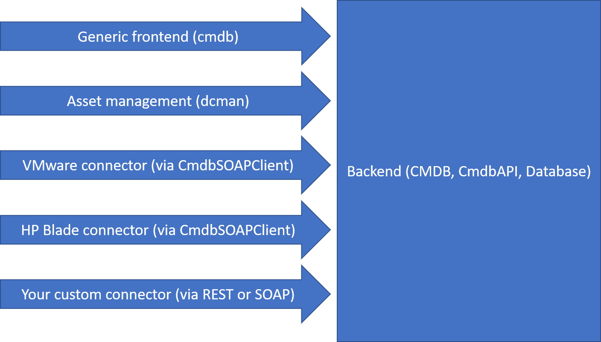

# Project overview
## Branches
The repository holds two branches. The 'master' branch is the development branch, that is not necessarily working at every point of time. The 'production' branch holds the tested and production ready projects.

## Projects
### DataBase
The schema for an MS SQL 2014+ database.

### CmdbAPI
The .NET Framework 4.8 library project with all the backend logic.

### CMDB
The ASP.NET 4.8 project with the REST API for the backend. It depends on CmdbAPI

### ng-frontend/backend-access
An Angular 9 library project that abstracts the backend access from the presentation layer and holds a lot of useful tools for building frontends.

### [ng-frontend/cmdb](../How-to-use-CMDB-=-Start)
The Angular 9 application project with the frontend for the CMDB. The generic approach may be a bit hard to understand, but gives great flexibility of design.

### [ng-frontend/dcman](../Project-DCMan)
An Angular 9 alternative frontend that gives a more comprehensive approach for asset and data center management.

### CmdbSoapClient
Deprecated. This .NET Framework 4.8 library abstracts the backend access from the presentation layer for WPF projects and holds some useful tools like caching meta data.

### RZ-Manager
Deprecated. This WPF project was an alternative frontend that gives a more comprehensive approach for asset and data center management.

## Project relationships

This picture illustrates the relationships between the projects.

